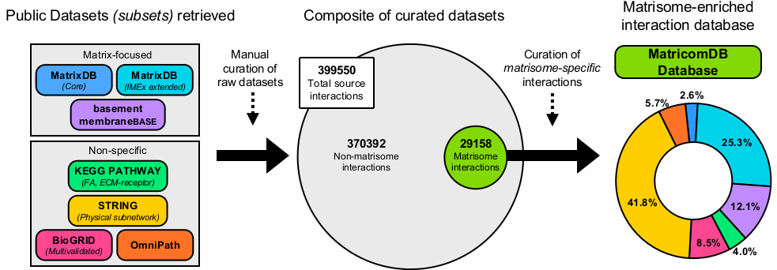
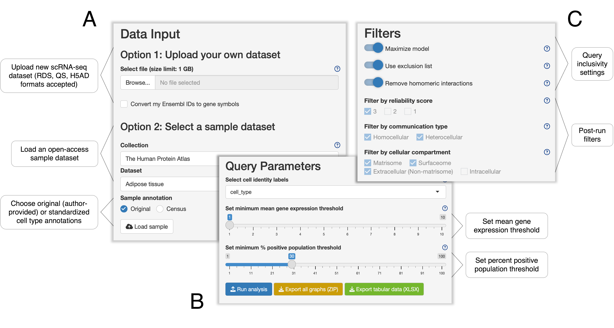

# MatriCom: matrisome communication in single-cell RNA-seq data.

* MatriCom features an intuitive graphical user interface implemented in R Shiny.
* MatriCom is available and **ready-to-use** online at https://matrinet.shinyapps.io/matricom/
* To locally install MatriCom on your own computer, see [INSTALL](INSTALL.md) instructions.
* Our curated interaction database, **MatriComDB**, is an integral part of the MatriCom package and can be downloaded separately [here](inst/webApp/www/MatricomDB/).
* To learn more, see [MatriCom-analyses](https://github.com/Izzilab/MatriCom-analyses), which include example analyses using open-access data and a case study.
* If you use MatriCom in your publication, please cite our upcoming manuscript: [doi XXXX](https://doi.org/) (*preprint at bioRxiv*)

* Authors and maintainers: Izzi Lab (✉️ <valerio.izzi@oulu.fi>) and Naba Lab (✉️ <anaba@uic.edu>)
* This work was supported by the following grants (green: Naba Lab; blue: Izzi Lab):

## Motivation
Single-cell RNA sequencing (scRNA-seq) enables the study of cell-cell communications within and across entire tissues, organs, and systems. The composition of the matrisome, a complex meshwork of extracellular matrix (ECM) and ECM-associated proteins, endowed with the scaffolding, enzymatic, and signaling activities necessary for multicellular organization, can be studied in high detail with scRNA-seq. Its role in forming communication networks within tissues and organs, however, cannot be studied equally in depth using existing computational tools. Because the biological properties of the matrisome differ in many ways from that of the intracellular proteome, matrisome interactions are largely under-represented by other tools whose algorithms are tailored towards the intracellular proteome and the signalosome.

To overcome these limitations, we present MatriCom, a tool to infer communication patterns both within the matrisome and between matrisome and and non-matrisome components from gene expression-level data, available both as an online and offline Shiny App. 

## MatriComDB
MatriCom identifies communicating gene pairs within single-cell RNA Sequencing (scRNA-seq) data by referencing MatriComDB, our curated database of matrisome interactions (available [here](inst/webApp/www/MatriComDB.xlsx) as an `XLSX` file). 

MatriComDB was built by compiling the following seven datasets: [MatrixDB](http://matrixdb.univ-lyon1.fr/) (core) and (IMEx extended), [basement membraneBASE](https://bmbase.manchester.ac.uk/), [KEGG](https://www.genome.jp/kegg/) ([Focal adhesion, hsa04510](https://www.genome.jp/entry/hsa04510); [ECM-receptor interaction, hsa04512](https://www.genome.jp/entry/hsa04512)), [STRING](https://string-db.org/) (physical subnetwork), [BioGRID](https://thebiogrid.org/) (multi-validated) and [OmniPath](https://omnipathdb.org/) (Figure 1). The combined datasets were then manually curated to include only communication pairs that feature at least one matrisome component.

  
**Figure 1. Construction of MatriComDB.**

The databases that comprise MatriComDB were ranked into three reliability levels based on their degree of experimental validation. Using the following ranking system, each communication pair was assigned a **reliability score**. 
* **Level 3**: Best and most reliable interactions from databases that are fully dedicated to the matrisome, or from matrisome-focused subsets, and where all interactions have been experimentally validated.
  * MatrixDB (core), KEGG (Focal adhesion, hsa04510; ECM-receptor interaction, hsa04512)
* **Level 2**: Reliable interactions from matrisome-dedicated databases, but where all interactions may not have been experimentally validated.
  * MatrixDB (IMEx extended), basement membraneBASE
* **Level 1**: Less reliable interactions sourced from massive, generalist databases.
  * STRING (physical subnetwork), BioGRID (multi-validated), OmniPath

Each pair was further characterized by the type of communication (*Non.matrisome-Matrisome* or *Matrisome-Matrisome*), division and category of matrisome partners, and localization of gene products (*Matrisome*, *Surfaceome*, *Extracellular (Non-matrisome)*, or *Intracellular*). In cases where a protein occupies multiple cellular compartments, we implemented the following hierarchy, such that genes encoding proteins that do not fall into one of three highest-ranked compartments are marked as intracellular:
  * Matrisome > Surfaceome > Extracellular (Non-matrisome) > Intracellular

Matrisome division and category annotations are from [The Matrisome Project](https://sites.google.com/uic.edu/matrisome/home). Sources for cellular compartment annotations are [The Matrisome Project](https://sites.google.com/uic.edu/matrisome/home), [The _in silico_ human Surfaceome](https://doi.org/10.1073/pnas.1808790115), and [Gene Ontology GO:0005576 (extracellular region)](https://www.ebi.ac.uk/QuickGO/term/GO:0005576).

## Workflow
The graphical user interface of MatriCom features a single input panel with three sections: **Data Input**, **Query Parameters**, and **Filters** (Figure 2).

**Figure 2. MatriCom user interface.** The input panel has three sections, shown separately here. A) Data Input: Users can upload their own annotated scRNA-seq dataset in `*.rds`, `*.qs` or `*.h5ad` format (*Option 1*) or load an open-access dataset with either original or Census sample annotations (*Option 2*). B) Query Parameters: Using the dropdown menu, users must select the column containing cell type labels. Users can adjust thresholds for mean gene expresion and percentage of positive cells per population using sliders. C) Filters: User can restrict results using query inclusivity settings, which filter output based on biological criteria, and post-run filters.

### Data Input
Using the *Browse* button, users may upload their own annotated scRNA-seq data in one of the supported file formats (Figure 2A, *Option 1*). The online version of MatriCom additionally provides the option to select a sample from our open-access data collections (Figure 2A, *Option 2*), publicly available online. Here, we offer analytical access to the entire [Tabula Sapiens](https://tabula-sapiens-portal.ds.czbiohub.org/) collection and [The Human Protein Atlas](https://www.proteinatlas.org/) (THPA) collection, as well as a set of data from the [Azimuth](https://azimuth.hubmapconsortium.org/) app collection. Where possible, THPA and Azimuth datasets are offered with both original and [Census](https://github.com/sjdlabgroup/Census) cell type annotations (Figure 2A, *Sample annotation*) to guarantee standardization with cell type assignments from Tabula Sapiens.

### Query Parameters
Upon successful upload of the annotated scRNA-seq dataset (*Option 1*), the **Select cell identity labels** dropdown menu (Figure 2B) automatically populates with a list of all column headers. Here, users must indicate which metadata column contains the set of cell identity labels to be used for sorting individual cells into populations (Figure 3A). For open-access datasets (*Option 2*), the `cell_type` column, containing either original or Census annotations, is selected by default.

**User-selected thresholds**  
The MatriCom algorithm considers all genes from the input data that pass the user-adjustable thresholds for mean (x̄) gene expression and percentage of positive cells (Figure 2B). These threshold values represent the minimum x̄ expression level at which a gene must be present in any population (Figure 3B, *Expression threshold*) and the minimum proportion of cells per population that must express the gene at x̄ level (Figure 3B, *Population threshold*). Any gene that does not meet these criteria is excluded from analysis.

**Identification of communication pairs**  
Within this pool of genes, MatriCom identifies communicating pairs across cell populations, as well as among cells of the same type (Figure 3C), and reports these communications in graphical and tabular formats (Figure 4; see [Results Output](#results-output) for details).

### INSERT NEW FIGURE 3 HERE

### Filters
After analysis is complete, users can apply a set of query inclusivity filters, including options for model maximization, exclusion lists, and homomeric interactions, as well as custom algorithms to refine results based on specific properties of matrisome proteins (Figure 2C). This avoids reporting "impossible" partners (*e.g.*, collagen subunits produced by different cells) and further removes redundancies to ease interpretation. All these filters can be turned on and off by the user (Figure 2C).

* **Maximize model**: Because MatriComDB was curated from multiple sources, analysis may return duplicate entries (*i.e.*, identical communicating genes and populations) with different reliability scores. When the **Maximize model** option is active, only the entry with the highest reliability is displayed in case of duplicates. This filter also excludes "reciprocal duplicates" (*i.e.*, inverted entries), such that if _GENE1_ ⮂ _GENE2_ between PopulationA ⮂ PopulationB and _GENE2_ ⮂ _GENE1_ between PopulationB ⮂ PopulationA both occur in the results, only one entry is reported. By default, this filter is active.

* **Use exclusion list**: Various multimeric matrisome proteins, such as collagens and laminins, must be assembled within a single cell prior to secretion into the extracellular space and, thus, cannot be produced or assembled by the cooperation of multiple different cell populations. When the **Use exclusion list** option is active, heterocellular communication pairs that represent exclusively intracellular interactions are removed from the results. By default, this filter is active.

* **Remove homomeric interactions**: Some matrisome multimers are the product of a single gene (*e.g.*, *COL1A1*). Thus, scoring homocellular communication pairs such as these is effectively the same as validating the presence of a single gene in the population, very likely biasing the results. When the **Remove homomeric interactions** option is active, pairs that represent homocellular homomeric interactions as removed from the results. By default, this filter is active.

Post-run filters for reliability, inter-population communication type, and cellular compartment are also available (Figure 2C):
* **Filter by reliability score**: Users can filter results by reliability level. Communication pairs are assigned reliability scores based on their degree of experimental validation (see [MatriComDB](#matricomdb) for details). For stringency, only entries with a reliability score of 3 are reported by default (Figure 4D, column `Reliability.score`).
* **Filter by communication type**: Users can filter the results to only include communicating gene pairs expressed by the same (*Homocellular*) or different (*Heterocellular*) cell types. By default, MatriCom results include communications established by both types of population pairs.
* **Filter by cellular compartment**: Users can filter the results according to the localization of the communicating gene products (see [MatriComDB](#matricomdb) for details). By default, MatriCom results include only communications involving genes that encode *Matrisome*, *Surfaceome*, and *Extracellular (Non-matrisome)* components. Note that all results generated by MatriCom involve  at least one matrisome gene, so deselecting the *Matrisome* option will remove **all** results. 

## Results Output
MatriCom returns results both as interactive graphics and as dynamic tables, sorted into three tabs: **_COMMUNICATION NETWORK_**, **_NETWORK INFLUENCERS_** and **_ENRICHMENT ANALYSIS_**. All data is downloadable as graphics and tables using the respective export buttons (Figure 2B). 

To demonstrate, we loaded *Adipose tissue* from *The Human Protein Atlas* collection and ran the analysis with default query parameters and filters (Figure 2). The results in the _COMMUNICATION NETWORK_ tab feature a cluster map of global communications (Figure 4A), a bar graph of the proportion of Non.matrisome-Matrisome vs Matrisome-Matrisome communication pairs (Figure 4B), a dot plot of gene pairs classified by matrisome category (Figure 4C), and a detailed communication network table (Figure 4D). Using network analysis algorthims, MatriCom identifies influencers and influenced genes in the network, which are featured in the _NETWORK INFLUENCERS_ tab (Figure 4E). Finally, the results from enrichment analysis using a set of matrisome-specific molecular signatures from [matrisome-MSigDB](https://sites.google.com/uic.edu/matrisome/resources/matrisome-msigdb), recently released by the Naba Lab, are shown in the _ENRICHMENT ANALYSIS_ tab (Figure 4F).

**Figure 4. Example of MatriCom output.** A) Global Communication Cluster Map: bubble size is proportional to the number of communications established by the represented population pair. Hovering the cursor over a bubble reveals identities of the communicating populations. B) Communication Pairs: percentage of Non.matrisome-Matrisome vs Matrisome-Matrisome pairs. C) Matrisome Pairs: distribution of gene pairs by matrisome category, where dot size is proportional to the number of communications. D) Full list of communicating genes and populations, including reliability scores, displayed as a table. E) Normalized Influence: network influencers and influenced genes, color-coded by matrisome division of influencers. Bubble size is proportional to relationship strength. F) Matrisome-specific Signature Enrichment: Bubbles are color-coded by gene set, and size is proportional to signature overlap per population-pair (vertical axis).

## See Also
* [Naba Lab](https://sites.google.com/a/uic.edu/nabalab/): official web-site and [@GitHub](https://github.com/Matrisome/).
* [Izzi Lab](https://www.oulu.fi/en/research-groups/izzi-group): official website and [@GitHub](https://github.com/izzilab).
* [The Matrisome Project](https://sites.google.com/uic.edu/matrisome/home): an open-access resource which aims to support and facilitate ECM research by sharing detailed protocols, tools, and datasets with the scientific community.
* [MatrisomeDB](https://matrisomedb.org/): a searchable database that integrates experimental proteomic data on the ECM composition of normal and diseased tissues.
* [MatrisomeAnalyzeR](https://github.com/Matrisome/MatrisomeAnalyzeR): an R package for ECM molecule annotation, classification, and analysis.
* [MatriNet](https://www.matrinet.org/): an interactive database to study the connectome and the network profiles of the ECM in healthy and neoplastic tissues and cells.
* [ProToDeviseR](https://github.com/Izzilab/protodeviser): an R package for the automatic generation of protein topology schemes in JSON format.
